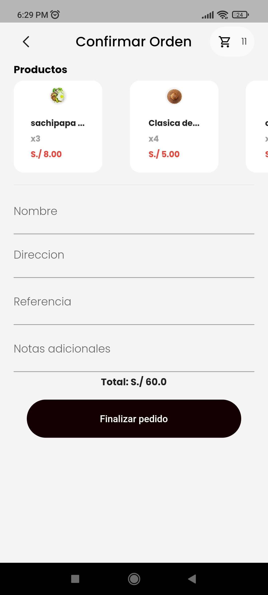

# Mikhuy(eat in Quechua)

## CONTENTS
- [Mikhuy(eat in Quechua)](#mikhuyeat-in-quechua)
  - [CONTENTS](#contents)
- [SUMMARY](#summary)
- [BUSINESS](#business)
  - [what is it](#what-is-it)
  - [Problem](#problem)
  - [what needs?](#what-needs)
  - [Organization chart](#organization-chart)
  - [main requirement](#main-requirement)
- [DESIGN](#design)
  - [use case diagram](#use-case-diagram)
  - [class diagram](#class-diagram)
- [API ENDPOINTS](#api-endpoints)
    - [PRODUCTS ENDPOINTS](#products-endpoints)
    - [USERS ENDPOINTS](#users-endpoints)
    - [TRUCKS ENDPOINTS](#trucks-endpoints)
    - [CART ENDPOINTS](#cart-endpoints)
    - [ACCOUNT ENDPOINTS](#account-endpoints)
    - [ORDERS ENDPOINTS](#orders-endpoints)
    - [POSTMAN](#postman)
- [MOBILE](#mobile)
  - [Sitemap](#sitemap)
  - [Screens](#screens)
  - [TECHNOLOGIES](#technologies)
    - [BACKEND](#backend)
    - [FRONTEND](#frontend)
    - [MOBILE](#mobile-1)
    - [DATABASE](#database)
    - [HOSTING](#hosting)
  - [DESIGN TOOL](#design-tool)
  - [METHODOLOGY](#methodology)
  - [Thrid party Services and tools](#thrid-party-services-and-tools)

# SUMMARY
Mikhuy is an app of a fast food trucks. The owner has several trucks(5) this app helps to receive orders of the customers.
|   |    |  
|--------------|----------------|
| | |

# BUSINESS
## what is it
Mikhuy is the app name of a fast food truck.
## Problem
The fast food truck is responsible for supplying food needs at night.
people come in person to order food.
## what needs?
The food truck needs an application to present its products and customers can order the products offered by the cart by delivering it.

## Organization chart
- Administrator
- Chef
- Food truck Driver
- Food delivery Driver
- customer
- Truck driver
- Truck Cashier
- Truck chef
- Chef assit
- Delivery driver
  

  
## main requirement
- **receive orders** and **deliver** products

# DESIGN

## use case diagram

## class diagram

# API ENDPOINTS
### PRODUCTS ENDPOINTS
|HTTP METHOD   | API ENDPOINT   | FUNCTION   |
|--------------|----------------|------------|
|GET   | `/products/list/`            | return list of all products
|GET   | `/products/list/<slug>/`     | return detail of product by slug
|GET   | `/products/related/<id>/`    | return related products of one product by id
|GET   | `/products/category/`        | return list of products by category
|GET   | `/products/category/<id>/`   | return specific products by category by id

### USERS ENDPOINTS
|HTTP METHOD   | API ENDPOINT   | FUNCTION   |
|--------------|----------------|------------|
|POST          | `/login/`      | return token and user data
|POST          | `/users/`      | create user by phone instead of username
|PUT           | `/users/<user_id>/change_password/`      | Update password
|PUT           | `/users/<user_id>/`      | Update Phone number 

### TRUCKS ENDPOINTS
|HTTP METHOD   | API ENDPOINT   | FUNCTION   |
|--------------|----------------|------------|
|GET           | `/trucks/`     | return list of trucks
|GET           | `/trucks/active`     | return true if there are any truck active

### CART ENDPOINTS
|HTTP METHOD   | API ENDPOINT   | FUNCTION   |
|--------------|----------------|------------|
|GET    | `/cart/`            | return current shopping cart. if the cart is used return new cart.
|POST   | `/cart/`            | add product to the cart by product_id
|PUT   | `/cart/cart-item/<int:pk>/`    | update quantity of product in the shopping cart by id of product
|DELETE   | `/cart/cart-item/<int:pk>/`        | delete product of the shopping cart by id of product in the cart
|GET   | `/cart/<product_id>/`   | verify if the product is in the shopping cart by product_id

> Authorization Token is required

### ACCOUNT ENDPOINTS
|HTTP METHOD   | API ENDPOINT   | FUNCTION   |
|--------------|----------------|------------|
|GET           | `/accounts/orders/`         | return list of orders of the user
|POST          | `/accounts/orders/6RDZVKIS` | return order detail of the user

> Authorization Token is required
### ORDERS ENDPOINTS
|HTTP METHOD   | API ENDPOINT   | FUNCTION   |
|--------------|----------------|------------|
|POST          |`/orders/checkout/`          | create order 
|PUT           |`/orders/checkout/`          | user can cancel order if the status does not change to received

> Authorization Token is required

### POSTMAN
|   |    |    |
|--------------|----------------|------------|
|| | |
| | ||

# MOBILE
## Sitemap

## Screens
|   |    |    | |
|--------------|----------------|------------|-----|
| | |  |  |
| | |  |  |
| | |  |  |

## TECHNOLOGIES
### BACKEND
- DRF

### FRONTEND
- TailwindCss

### MOBILE
- Flutter (Android/iOs)

### DATABASE
- PostgreSQL

### HOSTING
- Digital Ocean

## DESIGN TOOL
- draw.io (use case, class diagram,sequence)
- Whismical

## METHODOLOGY
- Kanban (Trello)

## Thrid party Services and tools
- [ibb.co](ibb.co) (free hosting of images)
- Postman (test api endpoints)